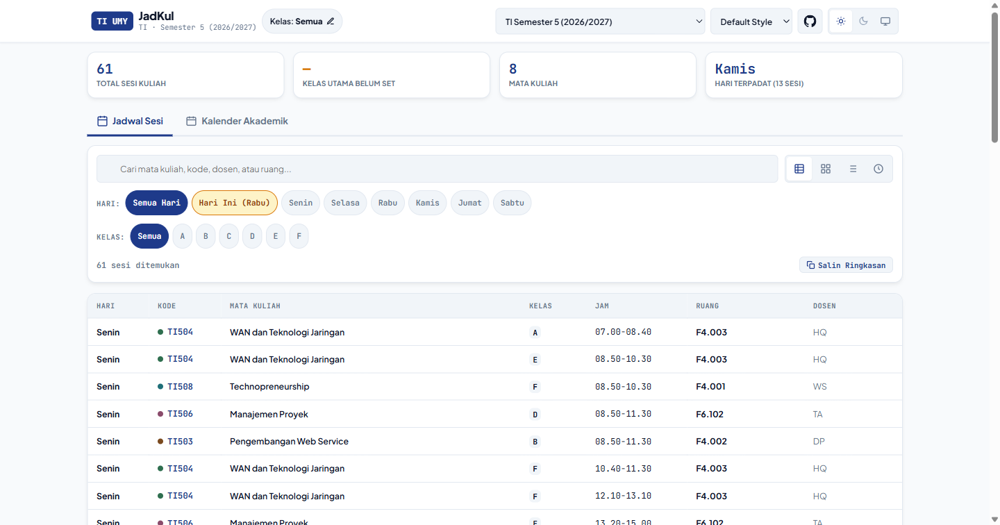
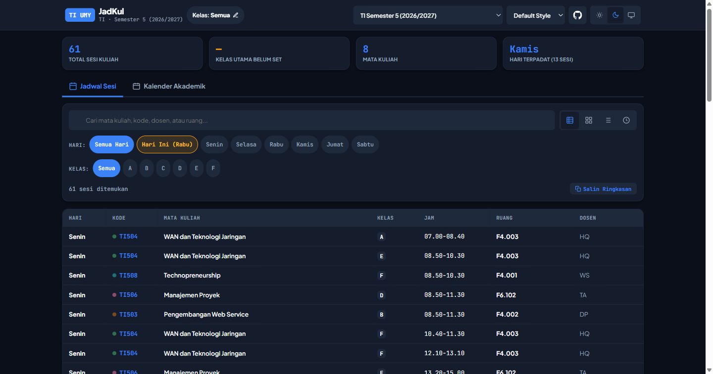
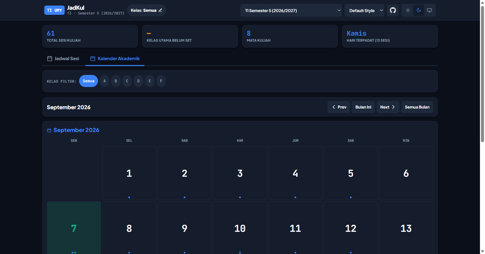
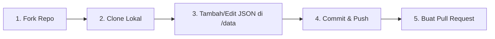

# 📅 JadKul — Jadwal Pengajaran TI UMY

[](https://yuumuu.github.io/jadwal-kuliah/)
[](LICENSE)
[](https://instagram.com/haidaryuum)

Sistem Informasi Jadwal Kuliah & Kalender Akademik untuk Program Studi **Teknologi Informasi, Universitas Muhammadiyah Yogyakarta (UMY)**.

Didesain dengan arsitektur **Mobile-First**, tanpa *dependencies/framework* berat, serta mendukung **6 Style Themes**, **Dark Mode**, dan **Pengelolaan Arsip Semester**.

---

## 🖼️ Tangkapan Layar (Documentation Screenshots)

| Tampilan Utama (Light Mode) | Tampilan Utama (Dark Mode) |
| :---: | :---: |
|  |  |

<p align="center">
  <b>Kalender Akademik dengan Angka Hari Maksimal & Indikator Agenda:</b><br>
  
</p>

---

## ✨ Fitur Unggulan

- **📱 Mobile-First Responsive Design**: Didesain dari bawah untuk peramban smartphone dengan *horizontal touch-scroll filter* dan tombol akses ramah sentuhan.
- **🎨 6 Style Themes**: Pilihan gaya antarmuka dinamis (*Default*, *Playful*, *Elegant*, *Minimal*, *Bento*, dan *Formal*).
- **🌙 Dark Theme Readiness 100%**: Dukungan Dark Mode menyeluruh untuk semua gaya tema, modal, dan elemen native HTML.
- **🗂️ Semester Aktif vs Arsip Jadwal**: Pemisahan otomatis semester aktif tahun ajaran berjalan dengan arsip jadwal tahun-tahun sebelumnya.
- **🔢 Kalender Akademik Interaktif**: Tampilan kalender bulan dengan angka hari yang diperbesar, penanda libur nasional, dan detail modal agenda.
- **📋 Salin Ringkasan Sesi (WhatsApp / Telegram)**: Fitur 1-klik untuk menyalin ringkasan jadwal dalam format teks rapi.
- **⚡ Zero Dependencies**: Dibangun murni menggunakan HTML5, CSS3, dan Vanilla JS (ES2020+) yang sangat ringan dan cepat dimuat.

---

## 🤝 Panduan Kontribusi (Contribution Guide)

Ingin menambahkan jadwal semester baru, memperbaiki data dosen/ruangan, atau memperbarui agenda akademik? **Kontribusi sangat terbuka untuk siapa saja!**

Ikuti langkah-langkah mudah di bawah ini menggunakan metode **Fork & Pull Request (PR)**:



### 📍 Langkah-Langkah Kontribusi

#### 1. Fork Repository
Klik tombol **Fork** di pojok kanan atas halaman repository ini ([https://github.com/yuumuu/jadwal-kuliah](https://github.com/yuumuu/jadwal-kuliah)) untuk menyalin repo ke akun GitHub Anda.

#### 2. Clone ke Perangkat Lokal
```bash
git clone https://github.com/USERNAME_ANDA/jadwal-kuliah.git
cd jadwal-kuliah
```

#### 3. Tambah atau Edit File JSON di Folder `data/`
- Jika ingin menambah semester baru, salin file template atau buat file baru: `data/ti-sX-gasal-YYYY.json`.
- Isi detail jadwal perkuliahan, libur nasional, dan warna mata kuliah mengikuti skema JSON.

#### 4. Daftarkan File di `data/jadwal.json`
Buka file `data/jadwal.json` dan tambahkan objek semester baru pada array `semesters`:

```json
{
  "id": "ti-s3-gasal-2026",
  "label": "Semester 3",
  "period": "Gasal",
  "academicYear": "2026/2027",
  "program": "TI",
  "semester": 3,
  "status": "active",
  "active": true,
  "startDate": "2026-09-01",
  "endDate": "2027-01-15",
  "file": "data/ti-s3-gasal-2026.json"
}
```

> **Catatan Status Arsip:** 
> Jika jadwal tersebut merupakan jadwal tahun lalu, atur `"status": "archived"` dan `"active": false`. Sistem akan otomatis mengelompokkannya ke bagian **Arsip Jadwal**.

#### 5. Commit & Push Perubahan
```bash
git add .
git commit -m "feat: tambah data jadwal Semester 3 Gasal 2026/2027"
git push origin main
```

#### 6. Buat Pull Request (PR)
Buka repository asli ([https://github.com/yuumuu/jadwal-kuliah](https://github.com/yuumuu/jadwal-kuliah)), lalu klik **Compare & Pull Request**. Jelaskan secara singkat perubahan data yang Anda tambahkan!

---

## 🛠️ Struktur Direktori

```
jadwal-kuliah/
├── index.html              # Aplikasi utama (Single Page Application)
├── data/
│   ├── jadwal.json         # Index master (Daftar semester aktif & arsip)
│   ├── ti-s1-gasal-2026.json # Detail jadwal TI Semester 1
│   ├── ti-s3-gasal-2026.json # Detail jadwal TI Semester 3
│   ├── ti-s5-gasal-2026.json # Detail jadwal TI Semester 5
│   ├── ti-s7-gasal-2026.json # Detail jadwal TI Semester 7
│   ├── ai-s1-gasal-2026.json # Detail jadwal AI Semester 1
│   ├── ti-peminatan-gasal-2026.json # Detail peminatan
│   └── template.json       # Template schema JSON kosong
├── docs/
│   └── screenshots/        # Dokumentasi tangkapan layar
└── README.md               # Dokumentasi proyek
```

---

## 💻 Menjalankan Secara Lokal

Karena aplikasi menggunakan `fetch()` API untuk memuat file JSON di folder `data/`, jalankan aplikasi menggunakan server HTTP lokal:

```bash
# Menggunakan Python
python -m http.server 8000

# Menggunakan Node.js / npx
npx serve .

# Menggunakan PHP
php -S localhost:8000
```
Buka `http://localhost:8000` di peramban Anda.

---

## 📩 Hubungi & Diskusi

Jika ada pertanyaan, saran fitur, atau kesulitan dalam membuat Pull Request data jadwal, silakan hubungi:

- **Instagram**: [@haidaryuum](https://instagram.com/haidaryuum)
- **GitHub Issues**: [Buka Issue Baru](https://github.com/yuumuu/jadwal-kuliah/issues)

---

## 📄 Lisensi

Proyek ini dirilis di bawah lisensi [MIT License](LICENSE). Bebas digunakan, dipelajari, dan dikembangkan secara bersama.
